# money-control
MoneyControl. Eine C# .NET MAUI App zum einfachen Erfassen und Verwalten persönlicher Ausgaben.

# 💰 MoneyControl
MoneyControl ist eine **C# .NET MAUI App** zum einfachen Erfassen und Verwalten persönlicher Ausgaben.

Benutzer können ihre Kosten eintragen, Kategorien erstellen und so besser den Überblick über ihr ausgegebenes Geld behalten.

Dieses Projekt ist ein **Lernprojekt**, um praktische Erfahrung mit **.NET MAUI, XAML, C# und SQLite** zu sammeln.

---

## 📱 Plattformen

Die App wurde mit **.NET MAUI** entwickelt und unterstützt theoretisch mehrere Plattformen:

- 📱 Android  
- 💻 Windows  
- 🍏 iOS  
- 💻 macOS  

Aktuell wurde die App **hauptsächlich für Android entwickelt und getestet**, da für iOS und macOS ein **MacBook benötigt wird**, um Apps zu erstellen und zu testen. (Emulator möglich, aber schwieriger und langsamer).

---

## 🔐 Benutzerkonto

Die App enthält ein einfaches **Login- und Registrierungssystem**.

Benutzer können:

- 📝 einen Account erstellen (Registrierung)
- 🔑 sich mit ihrem Account anmelden (Login)

---

## ✨ Funktionen

Aktuell bietet die App folgende Funktionen:

- 🔐 Benutzer registrieren und anmelden  
- ➕ Neue Ausgaben hinzufügen  
- 🗂 Eigene Kategorien erstellen  
- 🗑 Ausgaben löschen  
- 💾 Lokale Speicherung der Daten  

Der Benutzer kann dabei:

- 💰 den Betrag eingeben  
- 📝 eine Beschreibung der Ausgabe hinzufügen  
- 🗂 eine Kategorie auswählen  

---

## 🗄 Datenbank

Die App verwendet eine **lokale SQLite-Datenbank**, um Daten zu speichern.

Gespeichert werden:

- Benutzerkonten  
- Kategorien  
- Ausgaben  

Alle Daten werden **lokal auf dem Gerät gespeichert**, wodurch die App auch **offline funktioniert**.

---

## 🛠 Technologien

Dieses Projekt wurde mit folgenden Technologien entwickelt:

- **.NET MAUI**
- **C#** – App Logik
- **XAML** – Benutzeroberfläche
- **SQLite** – lokale Datenbank

---

## 🎯 Ziel des Projekts

Das Projekt dient als **Lernprojekt**, um Erfahrung zu sammeln mit:

- 📱 Cross-Platform App Entwicklung  
- 🎨 UI Entwicklung mit XAML  
- 🗄 Datenbanken in mobilen Apps  
- 🧠 Strukturierung von .NET MAUI Projekten  

---

## 📚 Status

🚧 Das Projekt befindet sich aktuell **noch in Entwicklung** und neue Funktionen werden **schrittweise hinzugefügt**.

---

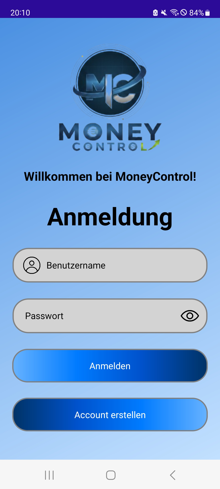
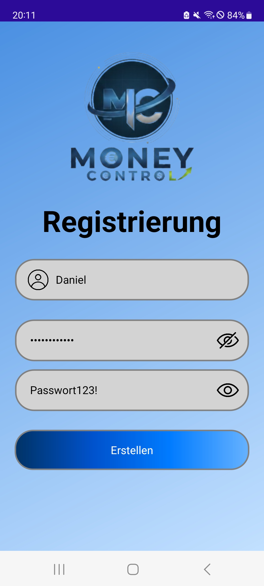
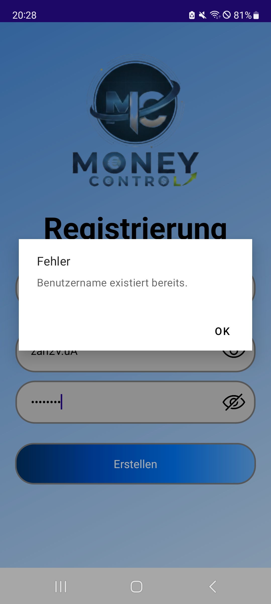
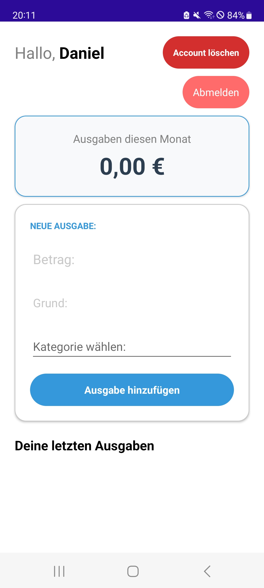
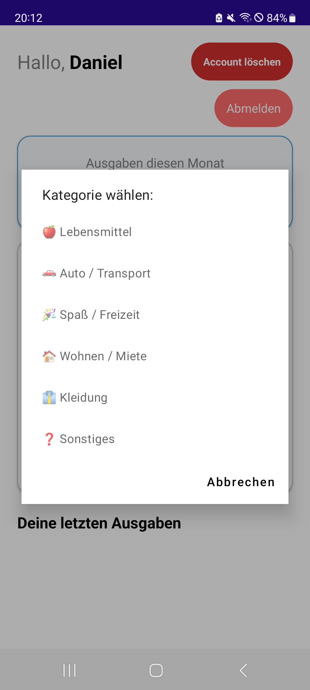
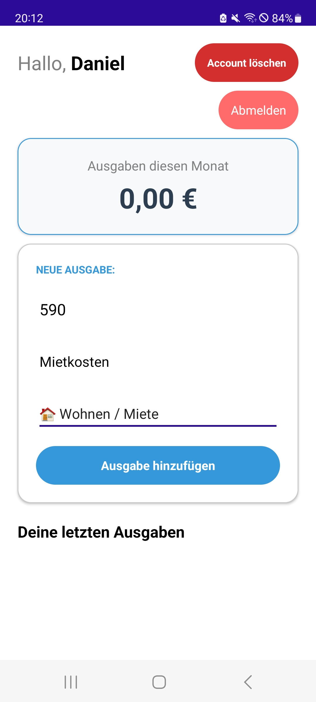
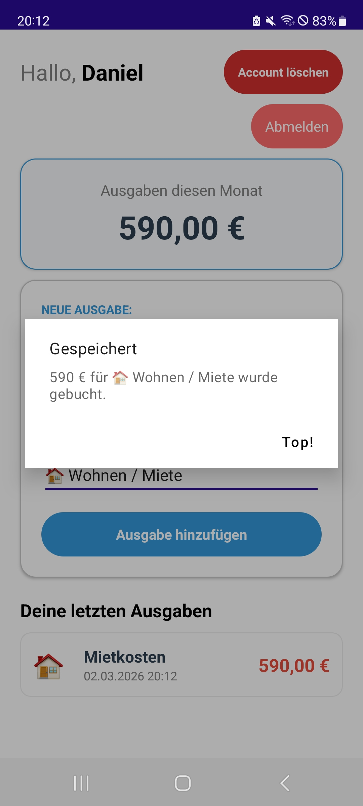
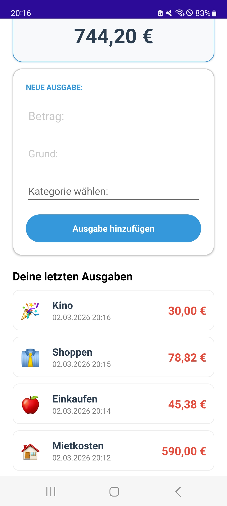
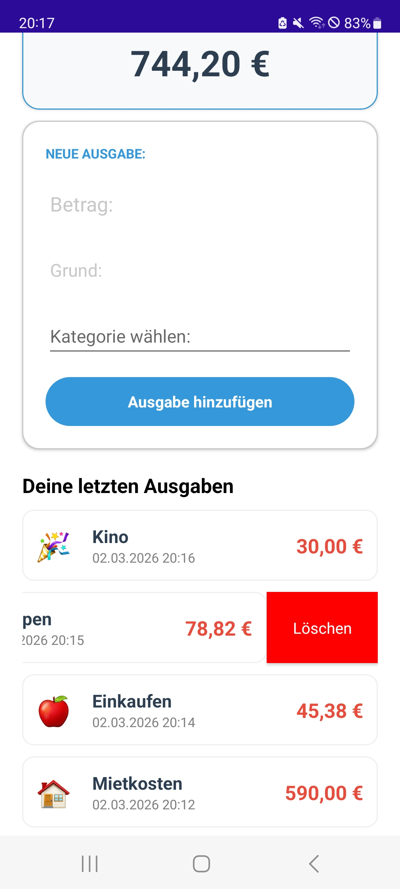
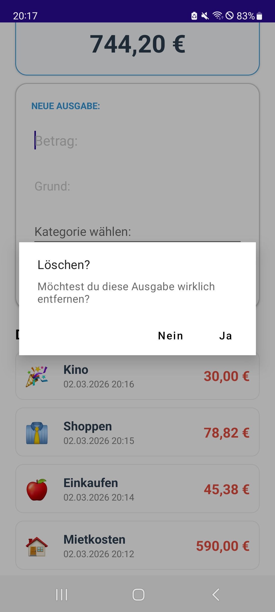

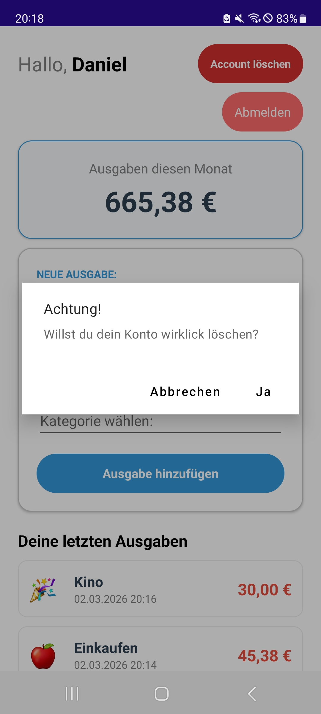
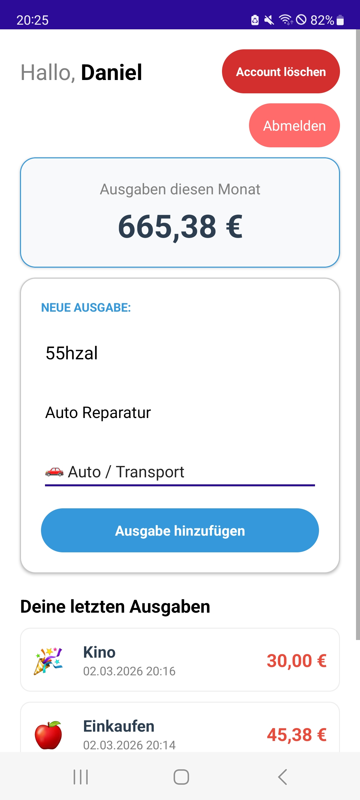
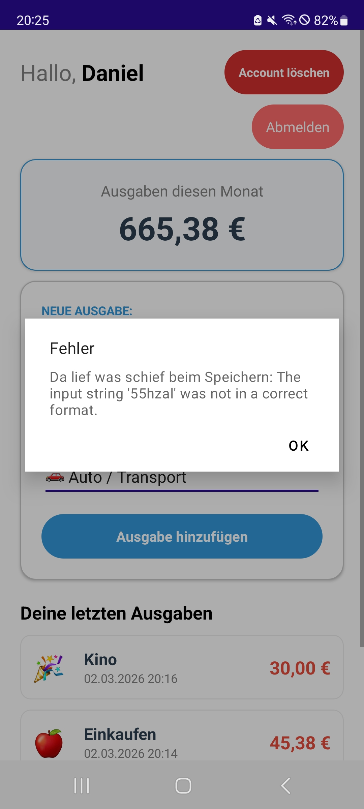

